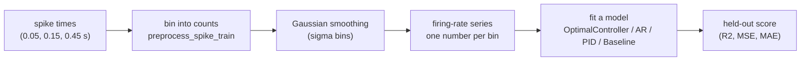
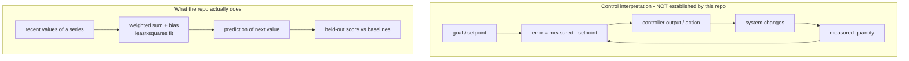
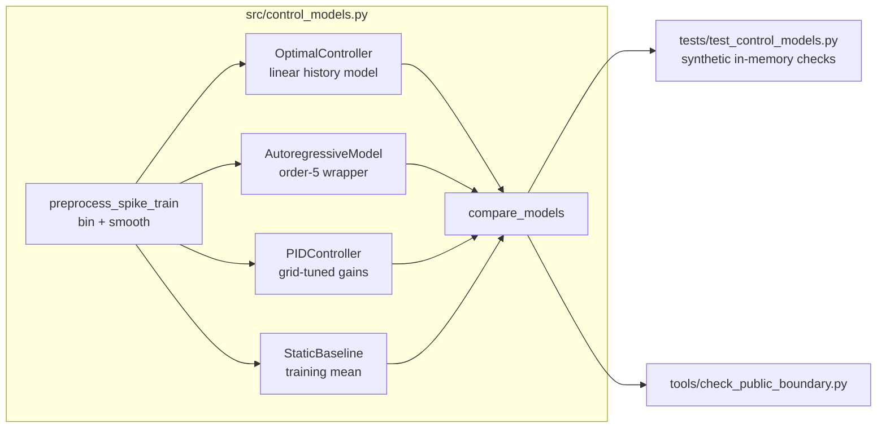

# Extended Introduction: Neural Time Series and Controller-Style Modeling

This document explains the repository from scratch for readers with **no background in neuroscience or control theory**. It builds every idea from everyday analogies, then connects each idea to the actual code in `src/control_models.py`. If you already know the basics, the shorter [Introduction](INTRODUCTION.md) may be enough.

## 1. What is a neural time series?

Neurons communicate with brief electrical pulses called **spikes**. If you record one neuron over time, you get a list of moments when it spiked: 0.05 s, 0.15 s, 0.45 s, and so on. That is an **event-time series** — like a list of timestamps when a shop door opened.

Spike timestamps are awkward to work with directly, so a common first step is to count how many spikes fall into small time windows ("bins") and divide by the bin width. The result is a **firing rate series**: one number per time bin saying how active the neuron was. This is exactly what `preprocess_spike_train` does, followed by a smoothing step that blurs each bin slightly into its neighbors (a Gaussian filter) so the series is less jagged. Think of it like turning individual door-opening timestamps into a smoothed "customers per minute" curve.

A **time series** is simply a sequence of numbers in time order. The interesting question about any time series is: does its past tell you anything about its future?

## 2. What is control theory? The thermostat intuition

**Control theory** is the engineering study of how to keep a system behaving the way you want by continuously correcting it. The canonical example is a thermostat:

1. It has a **setpoint** — the temperature you want (say 21°C).
2. It **measures** the actual temperature.
3. It computes an **error**: measured minus setpoint.
4. It takes an **action** (heat on/off) proportional to that error.
5. The action changes the room, which changes the next measurement. This loop — measure, compare, act — is **feedback**.

A **PID controller** is the classic generalization of the thermostat. It combines three reactions to the error:

- **P (proportional):** respond to the error *right now*. Big error, big correction.
- **I (integral):** respond to the *accumulated* error over time. If the room has been slightly too cold for an hour, the integral term grows and pushes harder — this removes stubborn small offsets.
- **D (derivative):** respond to how *fast* the error is changing. If the temperature is shooting toward the setpoint, the derivative term eases off early to avoid overshooting.

The weights on these three terms are called **gains** (`kp`, `ki`, `kd`). Choosing them is called **tuning**. Badly tuned gains oscillate or overcorrect; well-tuned gains settle quickly and stably.

## 3. What would "controller-style" modeling of neurons mean?

Here is the key analogy — and the key caution. Some researchers suspect that parts of the brain act like feedback controllers: a system holds a goal (a setpoint), senses the current state, computes an error, and acts to reduce it. Predictive-processing theories propose that cortical feedback carries predictions while feedforward signals carry residual errors (Rao and Ballard, 1999; Friston, 2005 — see the reference list in [INTRODUCTION.md](INTRODUCTION.md)). Optimal feedback control has been proposed as a theory of motor coordination (Todorov and Jordan, 2002).

But **predicting a signal from its past is not the same as showing the system is a controller**. An autoregressive fit says "recent values help predict the next value." A control interpretation requires much more: an identified goal, a measured quantity, an error signal, an action pathway, and a feedback route — measured or manipulated, not just fitted. The repository's own [Introduction](INTRODUCTION.md) is emphatic about this, and it is the single most important idea in this document.

So this repository adopts a deliberately modest position: it builds **transparent, controller-*style* software ingredients** (a history-based predictor, a PID-style reference simulation, baselines) and validates them on synthetic data, without claiming anything about real neurons yet.

## 4. Why data-free and synthetic methods matter

Real neural recordings are expensive, rare, often access-restricted, and easy to misinterpret. If you develop analysis code directly on precious data, two things go wrong: you can fool yourself (the data is finite and noisy, and you will keep tweaking until something "works"), and you can't easily share or check the work (the data may be private).

The alternative used here:

- **Synthetic inputs.** Every test uses in-memory series like `np.linspace(0.0, 1.0, 40)` or a sine wave. Anyone can run them, exactly, forever: `python -m unittest discover -s tests -v`.
- **Known ground truth.** With synthetic data you *know* what the code should do (a history of the wrong length must raise `ValueError`; a constant target makes R² undefined). That turns "does the code work?" into a checkable question.
- **A hard release boundary.** No datasets, figures, outputs, notebooks, or downloads enter the public tree; `tools/check_public_boundary.py` enforces this. See [RELEASE_BOUNDARY.md](RELEASE_BOUNDARY.md).

This is why the repository can honestly say: the software is validated; the neuroscience question is **untested**, not answered.

## 5. The repository pipeline, end to end

| Component | Plain-language description |
|---|---|
| `preprocess_spike_train` | Turn spike timestamps into a smoothed firing-rate series. |
| `OptimalController` | Predict the next value as a weighted sum of the last `history_length` values, fit by least squares. |
| `AutoregressiveModel` | The same idea under the standard statistics name, as a comparison model. |
| `PIDController` | Simulate a thermostat-style controller and pick its gains by a coarse grid search. |
| `StaticBaseline` | Always predict the training mean — the "do-nothing" yardstick. |
| `compare_models` | Fit all four on one series and collect their scores; a model that fails yields an `error` entry instead of crashing the comparison. |

## 6. The math actually used, in one sentence each

These are the exact computations in the code. Free learning resources are linked so you can learn each prerequisite independently — this document does not re-teach them.

- **Least-squares linear fit** (`OptimalController.fit`, via `np.linalg.lstsq`): choose the weights and bias that make the sum of squared prediction errors on the training portion as small as possible. *(Learn: [StatQuest — Linear Regression](https://www.youtube.com/watch?v=PaFPbb66DxQ); [3Blue1Brown — Essence of Linear Algebra](https://www.youtube.com/playlist?list=PLZHQObOWTQDPD3MizzM2xVFitgF8hE_ab).)*
- **Train/test split** (`fit`, 70/30): fit the model on the first ~70% of the series and score it only on the held-out remainder, so the score measures prediction on data the model never saw. *(Learn: [StatQuest — Cross Validation](https://www.youtube.com/watch?v=fSytzGwwBVw).)*
- **Error signal** (`error_signal = test_targets - predictions`): the difference between what happened and what was predicted — the same "error" idea as the thermostat, used here only as a score. *(Learn: [Khan Academy — residuals](https://www.khanacademy.org/math/statistics-probability/describing-relationships-quantitative-data).)*
- **R² (coefficient of determination)** (`_r2_score`): 1 minus (squared prediction error) divided by (squared spread of the targets), so 1.0 is perfect prediction and 0 means "no better than predicting the mean"; it is undefined (`nan`) when the targets are constant, because then there is no spread to compare against. *(Learn: [StatQuest — R-squared](https://www.youtube.com/watch?v=2AQKmw14mHM).)*
- **PID update** (`PIDController._simulate`): the prediction is `setpoint + kp·error + ki·(running sum of errors) + kd·(change in error)`. *(Learn: [Brian Douglas — PID control tutorials](https://www.youtube.com/@BrianBDouglas); [Wikipedia — PID controller](https://en.wikipedia.org/wiki/PID_controller).)*
- **Gain grid search** (`PIDController.fit`): try every combination of `kp` from 0–10 and `ki`, `kd` from 0–1 (6 values each) and keep the combination with the lowest training error. *(Learn: [StatQuest — tuning hyperparameters](https://www.youtube.com/watch?v=6Wpy_uGORbc).)*
- **Gaussian smoothing** (`preprocess_spike_train`): replace each bin with a weighted average of nearby bins, with weights shaped like a bell curve of width `sigma`. *(Learn: [3Blue1Brown convolutions-adjacent intuition](https://www.youtube.com/watch?v=KuXjwB4LzSA); [Khan Academy — normal distribution](https://www.khanacademy.org/math/statistics-probability/modeling-distributions-of-data).)*
- **Exponential decay scale** (`_estimate_decay_scale`): fit a straight line to the log of the lag-weight magnitudes versus lag, so the slope tells you how quickly the model's memory of the past fades. *(Learn: [Khan Academy — exponential models](https://www.khanacademy.org/math/algebra2/x2ec2f6f830c9fb89:exp-model).)*
- **Correlation coefficient** (`fit` result): a standardized measure of how closely predictions and targets move together, reported alongside R². *(Learn: [Seeing Theory — correlation](https://seeing-theory.brown.edu/).)*

## 7. What this repository does and does not claim

**Does:** provide working, validated, data-free software ingredients for history-based prediction and PID-style reference modeling of a one-dimensional series, with deterministic synthetic tests.

**Does not:** claim that neurons are controllers, that any model here is good for any real neural signal, or that any empirical result exists. Any future empirical study must be pre-planned behind maintainer (Scientific Owner) approval — see open issue #17 and [STATUS_AND_PLAN.md](STATUS_AND_PLAN.md).

For the conceptual literature behind these ideas (system identification, predictive processing, optimal feedback control, and the cautions about metaphors), see the verified reference list in [INTRODUCTION.md](INTRODUCTION.md). No additional citations are introduced here.
