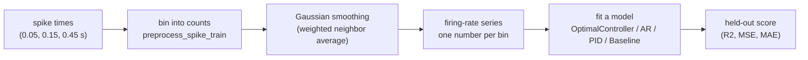
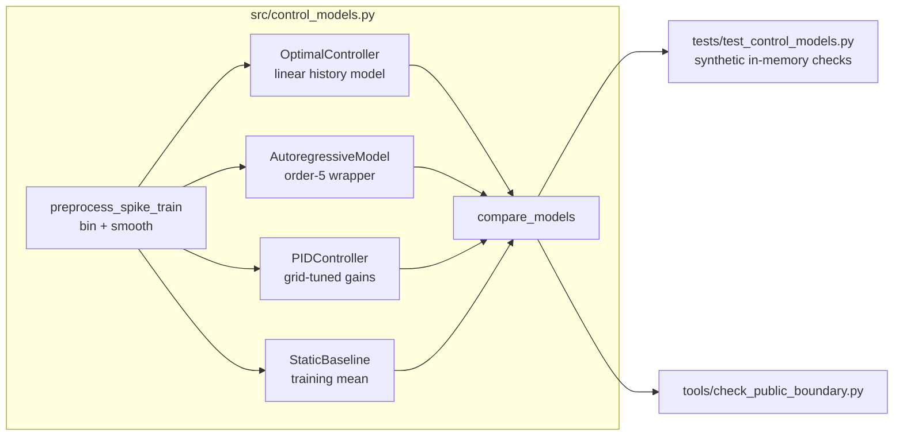

# Extended Introduction: Neural Time Series and Controller-Style Modeling

This document explains the repository from scratch for readers with **no background in neuroscience or control theory**. Every idea is built from a concrete everyday procedure with the arithmetic shown explicitly, and only then given its technical name. No calculus, no differential equations, no axioms — everything here is a finite procedure you could carry out with pencil and paper. If you already know the basics, the shorter [Introduction](INTRODUCTION.md) may be enough.

There is also no single correct way to think about any of the core ideas. So after each core concept you will find a **"many roads"** subsection: several independent mathematical lenses on the same concept, each with a tiny fully-worked example. Read whichever road matches how you think; skip the rest. They all arrive at the same place.

**Concept figure.** The feedback loop this repository circles around — and the smaller part of it that the code actually implements — is drawn in [concept_figure.md](concept_figure.md) as an embedded Mermaid diagram. (The release boundary does not allow image files in the tracked tree, so the figure lives as text.)

## 1. What is a neural time series?

Neurons communicate with brief electrical pulses called **spikes**. If you record one neuron over time, you get a list of moments when it spiked: 0.05 s, 0.15 s, 0.45 s, and so on. That is an **event-time series** — like a list of timestamps when a shop door opened.

Spike timestamps are awkward to work with directly, so a common first step is an explicit counting procedure: chop time into small windows ("bins"), count the spikes in each bin, and divide by the bin width. The result is a **firing rate series**: one number per bin saying how active the neuron was. This is exactly what `preprocess_spike_train` does, followed by a smoothing step that replaces each bin with a weighted average of its neighbors (a Gaussian filter — a smooth bump-shaped weighting, strongest at the center) so the series is less jagged. Think of it like turning individual door-opening timestamps into a smoothed "customers per minute" curve — you could do both with tally marks and a calculator.

A **time series** is simply a sequence of numbers in time order. The interesting question about any time series is: does its past tell you anything about its future?

### The many roads to noise and smoothing

The word "noise" and the smoothing step in the pipeline can be entered through several doors.

**Road 1: statistical mechanics by counting.** Suppose a neuron's spike count in a bin is the result of many tiny independent influences, and each count value is a "microstate" — one fully specific configuration; a "macrostate" is a count of how many microstates look alike. Some totals can be produced by vastly more arrangements than others, just as the total 7 from two dice arises 6 ways (1+6, 2+5, 3+4, 4+3, 5+2, 6+1) while 2 arises only 1 way (1+1). If you watch the system long enough, totals with high multiplicity dominate your data, and deviations from them are what we casually call noise. Worked example: three bins each hold 0, 1, or 2 spikes. A total of 3 spikes can be arranged 7 ways (0+1+2 in six orders, plus 1+1+1), while a total of 0 has exactly 1 arrangement (0+0+0). So a total near the middle is 7 times as "available" as the extreme — no forces, no physics, just counting. *What this buys you:* an intuition that typical values are typical because they are numerous, not because anything pushes toward them. *What it costs you:* it says nothing about how fast deviations die out, only how likely they are.

**Road 2: probability as frequencies.** Treat "noise" as the count of times reality departs from a repeated pattern. If you record 100 bins and the pattern says "3 spikes," you might see 2 spikes 18 times, 3 spikes 77 times, 4 spikes 5 times. The frequency table *is* the noise description: 18 + 5 = 23 of 100 bins deviated. Smoothing then means: borrow evidence from neighboring bins, because neighboring counts are mostly the same underlying situation re-rolled. Worked example: bins read [2, 3, 8, 3, 2]. Replacing the middle bin by the average of its two neighbors gives (3 + 3)/2 = 3, which kills the 8-spike outlier; the series becomes [2, 3, 3, 3, 2]. *What this buys you:* everything is checkable by recounting the table. *What it costs you:* it hides why the neighbors should be related at all — that is an assumption, not a fact.

**Road 3: geometry.** A series of length 5 is a point in 5-dimensional space; noise is a short arrow pushing the point off its "true" position, and smoothing is a projection — viewing the shadow of the point on a lower-dimensional, smoother wall. Worked example in 2D: the point (8, 3) projected onto the diagonal line x = y lands at (5.5, 5.5), because (8 + 3)/2 = 5.5. The jagged difference (8 − 3 = 5) is exactly what the shadow throws away. *What this buys you:* a picture — smoothing as shadow-casting, distance as disagreement. *What it costs you:* pictures in more than three dimensions are metaphors, and they hide the fact that you chose *which* wall to project onto.

**Road 4: information theory by counting.** Ask how many yes/no questions it takes to pin down a noisy value. A bin that holds one of 8 equally likely counts needs log2(8) = 3 questions; if smoothing tells you the bin must equal its neighbor's value, knowing the neighbor answers all 3 questions for free. That is the entire content of "neighboring bins are informative": they answer questions. Worked example: counts 0–7, unsmoothed series of 4 independent bins needs 4 × 3 = 12 questions; with perfect neighbor-redundancy you need 3 questions for the first bin and 0 for each repeat, total 3. *What this buys you:* a precise, countable sense of "redundancy." *What it costs you:* real series are rarely perfectly redundant, so the savings are an ideal case.

## 2. Control theory, built from a shower knob

Forget the textbook. You already know control theory from adjusting a shower.

1. You have a goal: water that feels "just warm enough." Call that goal the **setpoint**.
2. You put your hand in the stream. That is the **measurement**.
3. You compare: *too cold*. The gap between what you feel and what you want is the **error**.
4. You nudge the knob toward hot. That nudge is the **action**, and how far you nudge per unit of discomfort is your **gain**.
5. A second later the new water reaches your hand, and you repeat: measure, compare, nudge. That repeating loop is **feedback**.

Let us actually run this loop with numbers, because once you have done it by hand you know everything essential. Suppose the water temperature starts at 30 °C, your setpoint is 38 °C, and each step the knob adds *half the current error* to the temperature (a gain of 0.5). One step of arithmetic per row:

| Step | Measured | Error = setpoint − measured | Action = 0.5 × error | New temperature |
|---|---|---|---|---|
| 1 | 30.0 | 8.0 | 4.0 | 34.0 |
| 2 | 34.0 | 4.0 | 2.0 | 36.0 |
| 3 | 36.0 | 2.0 | 1.0 | 37.0 |
| 4 | 37.0 | 1.0 | 0.5 | 37.5 |
| 5 | 37.5 | 0.5 | 0.25 | 37.75 |

Five subtractions and five multiplications — that is feedback control. The temperature creeps toward 38 and the error shrinks by half each step. That creeping-toward-the-goal behavior is what engineers call **stability**: errors shrink instead of growing.

Now try a gain of 1.2 instead, so each step the knob adds 1.2 × error (the rule is t' = t + 1.2 × (38 − t), i.e. t' = −0.2 × t + 45.6): 30 → 39.6 → 37.68 → 38.06 → 37.99 … the temperature overshoots once, because the gain is greater than 1 so the correction overshoots the target, and then zig-zags with shrinking swings toward 38 — it settles because |1 − 1.2| = 0.2 < 1, so each new error is only 0.2 times the previous one. With a gain of 2 you get 30 → 46 → 30 → 46 forever: each step overshoots by the full error, exactly undoing the previous progress, so it never settles; above that, wilder and wilder swings — **instability**. So "gain tuning" is not an abstract theorem, it is the practical fact that timid corrections are slow and aggressive corrections overshoot. **Tuning** means picking gains that settle fast without oscillating.

A **PID controller** is just three ways of reacting to the same error sequence, added together:

- **P (proportional):** react to the error *right now* — exactly what the table above does.
- **I (integral):** react to the *running total* of all past errors. If the shower has been slightly too cold for a minute, the running total keeps growing, so you push harder until the stubborn offset disappears. Computing it is just adding a column of numbers.
- **D (derivative):** react to the *difference between the error now and the error a moment ago*. If the temperature is racing toward the setpoint (error shrinking fast), this term eases off early so you do not overshoot. Computing it is one subtraction.

That phrase — "the difference between now and a moment ago" — is all the rate-of-change you will ever need here. No differential equations anywhere: a derivative, in every computation in this repository, is two nearby numbers and a subtraction.

The weights on the three terms are the gains `kp`, `ki`, `kd`. The repository's `PIDController` picks them by **grid search**: try many gain combinations, simulate each one exactly as in the table above, keep the one with the smallest total error. An exhaustive to-do list, not a theorem.

### The many roads to feedback control

**Road 1: discrete iterated maps.** The whole controller is one rule: *tomorrow = f(today)*. Write the rule once, then apply it over and over. For the shower, tomorrow = today + 0.5 × (38 − today), which simplifies to tomorrow = 0.5 × today + 19. Start at 30: 30 → 34 → 36 → 37 → 37.5 — exactly the table above, produced by feeding each output back as the next input. Feedback *is* the iteration; there is nothing else. Worked example with the map tomorrow = 0.5 × today + 19 and today = 36: 0.5 × 36 = 18, 18 + 19 = 37, so the next temperature is 37. Repeat: 0.5 × 37 + 19 = 37.5. *What this buys you:* a complete, rigorous replacement for differential equations — every question about the loop becomes a question about iterating a rule on a table. *What it costs you:* you only ever see the system at the sampled instants; anything that happens between samples is invisible.

**Road 2: graph theory.** Draw the loop as nodes and directed edges: {measured value} → {error} → {action} → {system} → {measured value}. The loop is literally a cycle in this graph, and "feedback" is the existence of a directed cycle. Count a 4-node example by hand: with nodes M (measurement), E (error), A (action), S (system), the edges M→E, E→A, A→S, S→M form one cycle of length 4; remove any single edge and no cycle remains, which is exactly why a broken sensor (missing S→M edge) destroys control. *What this buys you:* structural facts — where the loop is, what breaks it, which parts influence which — without simulating anything. *What it costs you:* the graph says nothing about magnitudes; it cannot tell a gentle loop from a violent one.

**Road 3: game theory, controller versus disturbance.** Treat the controller and the world's disturbances as two players who alternate moves. The disturbance pushes the temperature off target; the controller best-responds by moving it back; the game settles when neither wants to move — the disturbance has spent its push and the controller sees zero error. Worked example as a 2×2-style payoff table from the controller's view, entries = squared error after one round (low is good for the controller):

| | disturbance pushes −2 | disturbance pushes +2 |
|---|---|---|
| action = 0 | (−2)² = 4 | 4 |
| action = +2 | 0 | 16 |

If the disturbance habitually pushes −2, the best response is action +2 (cost 0); but against a +2 push the same action overshoots (cost 16). A fixed policy is a commitment; tuning is choosing the commitment whose worst case you can live with. *What this buys you:* robustness thinking — design against an adversary, not an average day. *What it costs you:* real disturbances are not strategic opponents, so worst-case reasoning can be needlessly conservative.

**Road 4: automata and computation.** A controller is a finite-state machine whose state is its memory (the running total for I, the previous error for D) and whose transition table says: given state and new measurement, emit an action and update the state. Worked example, a P-only machine with gain 0.5 and setpoint 38: transition table row "measurement 34" → compute error 38 − 34 = 4, emit action 2, next state unchanged (a P controller has no memory). An I-term adds one state slot, "error total," updated by total_new = total_old + error. The whole of PID is a machine with exactly two memory slots and three arithmetic rules. *What this buys you:* a direct bridge to code — the repository's `_simulate` is this machine. *What it costs you:* the table view hides continuity; gains feel like arbitrary table entries rather than a tunable family.

### The many roads to a setpoint and stability

**Road 1: fixed point found by iteration.** A setpoint is the value the map does not move: a **fixed point**. Find it by asking "for which today does tomorrow = today?" For tomorrow = 0.5 × today + 19, set today = 0.5 × today + 19, so 0.5 × today = 19, so today = 38 — the setpoint, recovered without any word like "equilibrium" or any calculus. You can also find it the lazy way: iterate from any start (30 → 34 → 36 → 37 → 37.5 → …) and watch where the numbers stop moving. Worked check: 0.5 × 38 + 19 = 19 + 19 = 38. Fixed. *What this buys you:* stability becomes a concrete question — does iterating from a nearby value walk toward the fixed point or away? *What it costs you:* finding the fixed point does not by itself prove every start converges; a gain of 2 has the same fixed point and never settles.

**Road 2: statistical mechanics by counting.** Why does the system sit near the setpoint once tuned? Because in a noisy world, states near the setpoint are visited far more often — the controller keeps resetting the count. Imagine tallying visited temperatures over 1000 steps: a well-tuned loop might give 37.9–38.1 a count of 800, the band 37–37.9 a count of 150, everything else 50. The "macrostate" you observe (temperature at 38) is just the most populated tally bin, exactly like the dice totals in section 1. *What this buys you:* an interpretation of stability as *population*, robust to the fact that no single step is exactly at the setpoint. *What it costs you:* it is a static snapshot — it cannot distinguish a loop that settled from one that oscillates tightly inside the same bin.

**Road 3: geometry.** Plot the state as a point on a line and the setpoint as a target point; stability is the statement that the distance between them shrinks every step. For gain 0.5 the distances are 8, 4, 2, 1, 0.5 — each exactly half the previous. For gain 1.2 the distances are 8, 1.6, 0.32, 0.064, 0.0128 — each shrinking by a factor of 0.2, with sign flips (overshoot). The geometry makes "oscillation" visible as the point hopping across the target while slowly closing in. *What this buys you:* a single picture that separates "fast/slow" from "direct/oscillating." *What it costs you:* one-dimensional pictures do not prepare you for coupled systems whose distance can shrink in one direction while growing in another.

**Road 4: set theory.** Define the **safe set** as the set of errors you tolerate, say the set {errors with magnitude ≤ 2}. Stability becomes a membership statement: after some step, every later error belongs to the safe set, forever. Check the gain-0.5 table: errors 8, 4, 2, 1, 0.5 — from step 3 onward, all members of the safe set. Check gain 2: errors alternate −8, +8, −8, +8 — never members. Control design is then "choose gains so the trajectory enters and stays inside the target set." *What this buys you:* specifications — you can *state* a requirement (enter the set, never leave) and check it row by row. *What it costs you:* membership is binary; the lens hides how comfortably inside the set you are.

## 3. Prediction is not control — the distinction that defines this repo

Here is the key caution, and the single most important idea in this document. A feedback controller needs a goal, a measurement, an error, an action, and a feedback route. **Predicting a signal from its past requires none of those.** If your shower temperature followed a daily rhythm, you could predict tomorrow's temperature from last week's values without knowing whether anyone's hand is on the knob.

Some researchers suspect parts of the brain do implement loops like the shower one: predictive-processing theories propose that cortical feedback carries predictions while feedforward signals carry residual errors, and optimal feedback control has been proposed as a theory of motor coordination — see the reference list in [INTRODUCTION.md](INTRODUCTION.md). Those are explicit mechanistic proposals. Fitting a line to yesterday's values is not evidence for any of them. A control claim needs an identified setpoint, an error signal, an action pathway, and interventions — measured or manipulated, not just fitted.

So this repository adopts a deliberately modest position: it builds **transparent, controller-*style* software ingredients** (a history-based predictor, a PID-style reference simulation, baselines) and validates them on synthetic data, without claiming anything about real neurons yet.

### The many roads to prediction from history

**Road 1: linear algebra as weight tables.** The predictor is a table of mixing proportions: each of the last `history_length` values gets a weight, and the prediction is the weighted sum plus a bias. A matrix is just such a table; "fitting" is filling in the cells. Worked example with history 3, weights (0.5, 0.3, 0.1), bias 1, recent values (10, 20, 40): prediction = 0.5×10 + 0.3×20 + 0.1×40 + 1 = 5 + 6 + 4 + 1 = 16. Tracing one cell: the weight 0.1 on the oldest value means "a point of activity three steps ago contributes a tenth of a point to tomorrow's prediction." *What this buys you:* the entire model is inspectable — print the table and read it. *What it costs you:* a table of weights cannot express "if the value exceeds 5, ignore it"; the lens is limited to smooth mixing.

**Road 2: information theory by counting.** How much does the past actually tell you? Count questions. If tomorrow's value is one of 8 equally likely levels, you need log2(8) = 3 yes/no questions to pin it down with no history. If knowing yesterday always narrows tomorrow to 2 levels, yesterday answers log2(8) − log2(2) = 3 − 1 = 2 of your 3 questions. Worked example: over 64 days, each pair (yesterday, tomorrow) falls in one of 8 × 8 = 64 cells; if only 16 cells ever occur, uniformly, then the pair needs log2(16) = 4 questions instead of 6 — the structure saved 2 questions, which is the mutual information. *What this buys you:* a units-based measure ("how many questions answered") that works even when linear weights fail. *What it costs you:* you need many observations to fill the cells, and the counting ignores order and magnitude.

**Road 3: probability as frequencies.** Prediction is conditional counting: among all past occasions that looked like today, what happened next? Worked example on a 2×2 contingency table — rows = "yesterday high?", columns = "today high?", counts over 100 days: (yes, yes): 40; (yes, no): 10; (no, yes): 15; (no, no): 35. Given yesterday was high, today is high in 40 of 50 cases = 0.8; given yesterday low, only 15 of 50 = 0.3. That gap, 0.8 versus 0.3, *is* the predictive content of history — no fitting algorithm required. *What this buys you:* total transparency; every number is a recount. *What it costs you:* with continuous values or long histories the table explodes, which is precisely why the code uses weights instead.

**Road 4: set theory and logic.** The difference between prediction and control is a difference of ingredient sets. Prediction requires the set {past values, a rule, a score}. Control requires {setpoint, measurement, error, action, feedback route}. A fitted autoregression demonstrably uses only the first set; concluding "the system is a controller" means asserting the second set is populated — and nothing in the first set implies any member of the second. Worked example: the rule "tomorrow = 0.9 × today + 2" fits the shower series beautifully (34 ≈ 0.9 × 30 + 7 is close), yet the set it manipulates contains no setpoint and no action; the two sets have empty intersection. *What this buys you:* a crisp logical guard against over-interpretation. *What it costs you:* sets say what is absent, not what further experiment would settle the question.

## 4. Why data-free and synthetic methods matter

Real neural recordings are expensive, rare, often access-restricted, and easy to misinterpret. If you develop analysis code directly on precious data, two things go wrong: you can fool yourself (the data is finite and noisy, and you will keep tweaking until something "works"), and you cannot easily share or check the work (the data may be private).

The alternative used here:

- **Synthetic inputs.** Every test uses in-memory series like a ramp of forty evenly spaced numbers or a sine wave. Anyone can run them, exactly, forever: `python -m unittest discover -s tests -v`.
- **Known ground truth.** With synthetic data you *know* what the code should do (a history of the wrong length must raise `ValueError`; a constant target makes R² undefined). That turns "does the code work?" into a checkable question with a definite answer.
- **A hard release boundary.** No datasets, figures, outputs, notebooks, or downloads enter the public tree; `tools/check_public_boundary.py` enforces this. See [RELEASE_BOUNDARY.md](RELEASE_BOUNDARY.md).

This is why the repository can honestly say: the software is validated; the neuroscience question is **untested**, not answered.

## 5. The repository pipeline, end to end

| Component | Plain-language description |
|---|---|
| `preprocess_spike_train` | Turn spike timestamps into a smoothed firing-rate series. |
| `OptimalController` | Predict the next value as a weighted sum of the last `history_length` values, fit by least squares (picking the line that makes the sum of squared vertical misses smallest). |
| `AutoregressiveModel` | The same idea under the standard statistics name, as a comparison model. |
| `PIDController` | Simulate a shower-knob-style controller and pick its gains by a coarse grid search. |
| `StaticBaseline` | Always predict the training mean — the "do-nothing" yardstick. |
| `compare_models` | Fit all four on one series and collect their scores; a model that fails yields an `error` entry instead of crashing the comparison. |

## 6. The math actually used, each as a finite procedure

These are the exact computations in the code, stated as recipes you could execute by hand. Each is explained inline, so no external resources are needed.

- **Least-squares linear fit** (`OptimalController.fit`, via `np.linalg.lstsq`): try to make each training prediction a weighted sum of recent values plus a bias, then choose the weights and bias that make the total of squared prediction misses as small as possible — in short, pick the line that makes the sum of squared vertical misses smallest. "Squared" just means: multiply each miss by itself, so big misses count extra and sign cancels.
- **Train/test split** (`fit`, 70/30): fit on the first ~70% of the series and score only on the held-out remainder, so the score measures prediction on data the model never saw.
- **Error signal** (`error_signal = test_targets - predictions`): subtract what was predicted from what happened — the same subtraction as the shower table, used here only as a score.
- **R² (coefficient of determination)** (`_r2_score`): take the total of squared misses, divide it by the total of squared deviations of the targets from their own mean, and subtract the result from 1. So 1.0 is perfect prediction and 0 means "no better than always predicting the mean"; it is undefined (`nan`) when the targets are constant, because then there is no spread to compare against.
- **PID update** (`PIDController._simulate`): the prediction is `setpoint + kp·error + ki·(running sum of errors) + kd·(error now minus error a moment ago)` — the shower table with three columns added.
- **Gain grid search** (`PIDController.fit`): try every combination of `kp` from 0–10 and `ki`, `kd` from 0–1 (6 values each) and keep the combination with the lowest training error.
- **Gaussian smoothing** (`preprocess_spike_train`): replace each bin with a weighted average of nearby bins, with weights shaped like a bell curve — a smooth bump-shaped weighting, strongest at the center — of width `sigma`.
- **Exponential decay scale** (`_estimate_decay_scale`): take the magnitudes of the fitted lag-weights, take their logarithms, fit a straight line of log-magnitude versus lag, and read off the slope — it tells you how quickly the model's memory of the past fades. Each step is a button on a calculator.
- **Correlation coefficient** (`fit` result): a standardized measure of how closely predictions and targets move together, reported alongside R².

## 7. What this repository does and does not claim

**Does:** provide working, validated, data-free software ingredients for history-based prediction and PID-style reference modeling of a one-dimensional series, with deterministic synthetic tests.

**Does not:** claim that neurons are controllers, that any model here is good for any real neural signal, or that any empirical result exists. Any future empirical study must be pre-planned behind maintainer (Scientific Owner) approval — see open issue #17 and [STATUS_AND_PLAN.md](STATUS_AND_PLAN.md).

For the conceptual literature behind these ideas (system identification, predictive processing, optimal feedback control, and the cautions about metaphors), see the verified reference list in [INTRODUCTION.md](INTRODUCTION.md). No additional citations are introduced here.

## Choosing your road

If you think in code and state machines, take the **automata** roads — a controller is a two-slot memory machine. If you think in loops and step-by-step tables, take **discrete iterated maps** — tomorrow as a function of today is the entire dynamics. If you think in pictures, take **geometry** — stability is a shrinking distance, smoothing is a shadow. If you think in tallies and counting, take **statistical mechanics** and **probability as frequencies** — noise and typicality are just multiplicities and recounts. If you think in structure and connections, take **graph theory** — feedback is a cycle, and cutting an edge kills it. If you think in incentives and opponents, take **game theory** — tuning is choosing a move you can defend against a worst-case disturbance. If you think in what-must-exist checklists, take **set theory** — prediction and control differ by which ingredient sets are populated. If you think in tables of mixing proportions, take **linear algebra as weight tables**. And if you think in questions and answers, take **information theory** — prediction quality is how many yes/no questions the past answers about the future.
