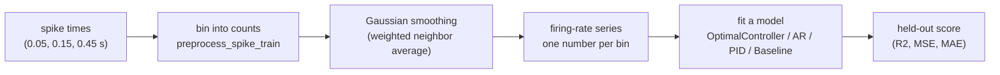
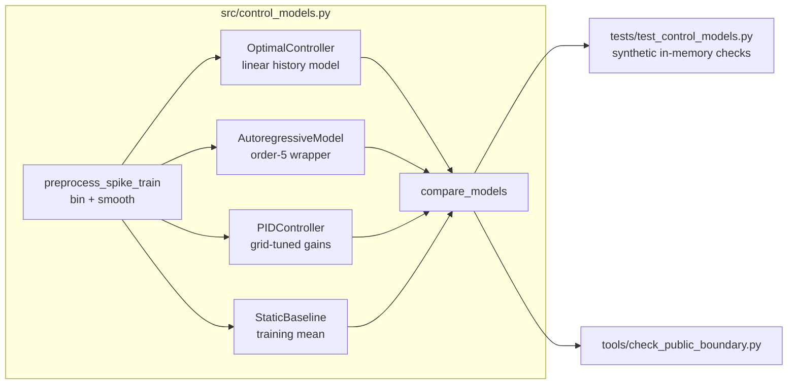

# Extended Introduction: Neural Time Series and Controller-Style Modeling

This document explains the repository from scratch for readers with **no background in neuroscience or control theory**. Every idea is built from a concrete everyday procedure with the arithmetic shown explicitly, and only then given its technical name. No calculus, no differential equations, no axioms — everything here is a finite procedure you could carry out with pencil and paper. If you already know the basics, the shorter [Introduction](INTRODUCTION.md) may be enough.

**Concept figure.** The feedback loop this repository circles around — and the smaller part of it that the code actually implements — is drawn in [concept_figure.md](concept_figure.md) as an embedded Mermaid diagram. (The release boundary does not allow image files in the tracked tree, so the figure lives as text.)

## 1. What is a neural time series?

Neurons communicate with brief electrical pulses called **spikes**. If you record one neuron over time, you get a list of moments when it spiked: 0.05 s, 0.15 s, 0.45 s, and so on. That is an **event-time series** — like a list of timestamps when a shop door opened.

Spike timestamps are awkward to work with directly, so a common first step is an explicit counting procedure: chop time into small windows ("bins"), count the spikes in each bin, and divide by the bin width. The result is a **firing rate series**: one number per bin saying how active the neuron was. This is exactly what `preprocess_spike_train` does, followed by a smoothing step that replaces each bin with a weighted average of its neighbors (a Gaussian filter) so the series is less jagged. Think of it like turning individual door-opening timestamps into a smoothed "customers per minute" curve — you could do both with tally marks and a calculator.

A **time series** is simply a sequence of numbers in time order. The interesting question about any time series is: does its past tell you anything about its future?

## 2. Control theory, built from a shower knob

Forget the textbook. You already know control theory from adjusting a shower.

1. You have a goal: water that feels "just warm enough." Call that goal the **setpoint**.
2. You put your hand in the stream. That is the **measurement**.
3. You compare: *too cold*. The gap between what you feel and what you want is the **error**.
4. You nudge the knob toward hot. That nudge is the **action**, and how far you nudge per unit of discomfort is your **gain**.
5. A second later the new water reaches your hand, and you repeat: measure, compare, nudge. That repeating loop is **feedback**.

Let us actually run this loop with numbers, because once you have done it by hand you know everything essential. Suppose the water temperature starts at 30 °C, your setpoint is 38 °C, and each step the knob adds *half the current error* to the temperature (a gain of 0.5). One step of arithmetic per row:

| Step | Measured | Error = setpoint − measured | Action = 0.5 × error | New temperature |
|---|---|---|---|---|
| 1 | 30.0 | 8.0 | 4.0 | 34.0 |
| 2 | 34.0 | 4.0 | 2.0 | 36.0 |
| 3 | 36.0 | 2.0 | 1.0 | 37.0 |
| 4 | 37.0 | 1.0 | 0.5 | 37.5 |
| 5 | 37.5 | 0.5 | 0.25 | 37.75 |

Five subtractions and five multiplications — that is feedback control. The temperature creeps toward 38 and the error shrinks by half each step. That creeping-toward-the-goal behavior is what engineers call **stability**: errors shrink instead of growing.

Now try a gain of 1.2 instead: 30 → 39.6 → 36.1 → 38.4 → 37.3 … the temperature overshoots and oscillates. With a gain of 2 you get 30 → 38 → 30 → 38 forever; above that, wilder and wilder swings — **instability**. So "gain tuning" is not an abstract theorem, it is the practical fact that timid corrections are slow and aggressive corrections overshoot. **Tuning** means picking gains that settle fast without oscillating.

A **PID controller** is just three ways of reacting to the same error sequence, added together:

- **P (proportional):** react to the error *right now* — exactly what the table above does.
- **I (integral):** react to the *running total* of all past errors. If the shower has been slightly too cold for a minute, the running total keeps growing, so you push harder until the stubborn offset disappears. Computing it is just adding a column of numbers.
- **D (derivative):** react to the *difference between the error now and the error a moment ago*. If the temperature is racing toward the setpoint (error shrinking fast), this term eases off early so you do not overshoot. Computing it is one subtraction.

That phrase — "the difference between now and a moment ago" — is all the rate-of-change you will ever need here. No differential equations anywhere: a derivative, in every computation in this repository, is two nearby numbers and a subtraction.

The weights on the three terms are the gains `kp`, `ki`, `kd`. The repository's `PIDController` picks them by **grid search**: try many gain combinations, simulate each one exactly as in the table above, keep the one with the smallest total error. An exhaustive to-do list, not a theorem.

## 3. Prediction is not control — the distinction that defines this repo

Here is the key caution, and the single most important idea in this document. A feedback controller needs a goal, a measurement, an error, an action, and a feedback route. **Predicting a signal from its past requires none of those.** If your shower temperature followed a daily rhythm, you could predict tomorrow's temperature from last week's values without knowing whether anyone's hand is on the knob.

Some researchers suspect parts of the brain do implement loops like the shower one: predictive-processing theories propose that cortical feedback carries predictions while feedforward signals carry residual errors (Rao and Ballard, 1999; Friston, 2005), and optimal feedback control has been proposed as a theory of motor coordination (Todorov and Jordan, 2002) — see the reference list in [INTRODUCTION.md](INTRODUCTION.md). Those are explicit mechanistic proposals. Fitting a line to yesterday's values is not evidence for any of them. A control claim needs an identified setpoint, an error signal, an action pathway, and interventions — measured or manipulated, not just fitted.

So this repository adopts a deliberately modest position: it builds **transparent, controller-*style* software ingredients** (a history-based predictor, a PID-style reference simulation, baselines) and validates them on synthetic data, without claiming anything about real neurons yet.

## 4. Why data-free and synthetic methods matter

Real neural recordings are expensive, rare, often access-restricted, and easy to misinterpret. If you develop analysis code directly on precious data, two things go wrong: you can fool yourself (the data is finite and noisy, and you will keep tweaking until something "works"), and you cannot easily share or check the work (the data may be private).

The alternative used here:

- **Synthetic inputs.** Every test uses in-memory series like a ramp of forty evenly spaced numbers or a sine wave. Anyone can run them, exactly, forever: `python -m unittest discover -s tests -v`.
- **Known ground truth.** With synthetic data you *know* what the code should do (a history of the wrong length must raise `ValueError`; a constant target makes R² undefined). That turns "does the code work?" into a checkable question with a definite answer.
- **A hard release boundary.** No datasets, figures, outputs, notebooks, or downloads enter the public tree; `tools/check_public_boundary.py` enforces this. See [RELEASE_BOUNDARY.md](RELEASE_BOUNDARY.md).

This is why the repository can honestly say: the software is validated; the neuroscience question is **untested**, not answered.

## 5. The repository pipeline, end to end

| Component | Plain-language description |
|---|---|
| `preprocess_spike_train` | Turn spike timestamps into a smoothed firing-rate series. |
| `OptimalController` | Predict the next value as a weighted sum of the last `history_length` values, fit by least squares. |
| `AutoregressiveModel` | The same idea under the standard statistics name, as a comparison model. |
| `PIDController` | Simulate a shower-knob-style controller and pick its gains by a coarse grid search. |
| `StaticBaseline` | Always predict the training mean — the "do-nothing" yardstick. |
| `compare_models` | Fit all four on one series and collect their scores; a model that fails yields an `error` entry instead of crashing the comparison. |

## 6. The math actually used, each as a finite procedure

These are the exact computations in the code, stated as recipes you could execute by hand. Named learning resources are mentioned by title only, so you can find each one independently — this document does not re-teach them.

- **Least-squares linear fit** (`OptimalController.fit`, via `np.linalg.lstsq`): try to make each training prediction a weighted sum of recent values plus a bias, then choose the weights and bias that make the total of squared prediction misses as small as possible. "Squared" just means: multiply each miss by itself, so big misses count extra and sign cancels. *(Learn: the StatQuest video on linear regression; the 3Blue1Brown series Essence of Linear Algebra.)*
- **Train/test split** (`fit`, 70/30): fit on the first ~70% of the series and score only on the held-out remainder, so the score measures prediction on data the model never saw. *(Learn: the StatQuest video on cross validation.)*
- **Error signal** (`error_signal = test_targets - predictions`): subtract what was predicted from what happened — the same subtraction as the shower table, used here only as a score. *(Learn: the Khan Academy unit on residuals.)*
- **R² (coefficient of determination)** (`_r2_score`): take the total of squared misses, divide it by the total of squared deviations of the targets from their own mean, and subtract the result from 1. So 1.0 is perfect prediction and 0 means "no better than always predicting the mean"; it is undefined (`nan`) when the targets are constant, because then there is no spread to compare against. *(Learn: the StatQuest video on R-squared.)*
- **PID update** (`PIDController._simulate`): the prediction is `setpoint + kp·error + ki·(running sum of errors) + kd·(error now minus error a moment ago)` — the shower table with three columns added. *(Learn: Brian Douglas's PID control video tutorials; the Wikipedia article on PID controllers.)*
- **Gain grid search** (`PIDController.fit`): try every combination of `kp` from 0–10 and `ki`, `kd` from 0–1 (6 values each) and keep the combination with the lowest training error. *(Learn: the StatQuest video on tuning hyperparameters.)*
- **Gaussian smoothing** (`preprocess_spike_train`): replace each bin with a weighted average of nearby bins, with weights shaped like a bell curve of width `sigma`. *(Learn: the 3Blue1Brown video on convolutions; the Khan Academy unit on the normal distribution.)*
- **Exponential decay scale** (`_estimate_decay_scale`): take the magnitudes of the fitted lag-weights, take their logarithms, fit a straight line of log-magnitude versus lag, and read off the slope — it tells you how quickly the model's memory of the past fades. Each step is a button on a calculator. *(Learn: the Khan Academy unit on exponential models.)*
- **Correlation coefficient** (`fit` result): a standardized measure of how closely predictions and targets move together, reported alongside R². *(Learn: the Seeing Theory interactive chapter on correlation.)*

## 7. What this repository does and does not claim

**Does:** provide working, validated, data-free software ingredients for history-based prediction and PID-style reference modeling of a one-dimensional series, with deterministic synthetic tests.

**Does not:** claim that neurons are controllers, that any model here is good for any real neural signal, or that any empirical result exists. Any future empirical study must be pre-planned behind maintainer (Scientific Owner) approval — see open issue #17 and [STATUS_AND_PLAN.md](STATUS_AND_PLAN.md).

For the conceptual literature behind these ideas (system identification, predictive processing, optimal feedback control, and the cautions about metaphors), see the verified reference list in [INTRODUCTION.md](INTRODUCTION.md). No additional citations are introduced here.
