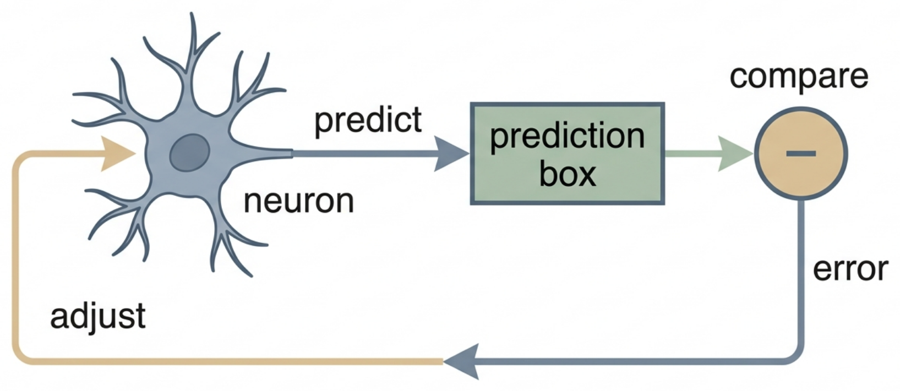

# Introduction: Prediction, Feedback, and Neural Time Series

> **Start here — scope.** The explanations of neurons, changing measurements, prediction, and feedback below are **general background**. This repository’s bounded result is much narrower: it is a working **synthetic methods prototype** with data-free utilities and deterministic tests that use invented, in-memory inputs. It contains no neural dataset, empirical benchmark, figure, statistical comparison, or observed neural result. It therefore does **not** show that a neuron, a neural circuit, or a neural system is an adaptive controller. It also does not report an empirical success or failure.

*Figure 1: A neuron sits inside a control loop: it predicts its next measurement, compares prediction with observation, and feeds the difference back to adjust itself. (Editable Mermaid source: [figures/concept_figure.md](figures/concept_figure.md).)*

## A concept ladder: from a changing observation to a careful question

### 1. Begin with the biological backdrop, not a conclusion

A **neuron** is a cell that communicates with other cells using electrical and chemical signals. A nervous system contains many neurons and many other kinds of cells. That broad fact is useful background, but it does not tell us what any one list of numbers means or how a biological system works.

A **neural signal** is a broad label for a measurement or a number derived from a measurement related to nervous-system activity. An instrument may detect brief events, measure a changing electrical quantity, or record something else entirely. The measurement is an **observation**. It is not automatically an explanation of the cells, connections, or causes that produced it.

This distinction is important throughout this repository. A number can be useful to describe or predict another number without revealing a biological mechanism. The repository accepts caller-supplied numbers; it does not decide what those numbers represent, collect them, or establish that they are adequate for a biological question.

### 2. Turn observations into a time-ordered list

A **time series** is a list of values in time order. For example, a list might have one value for each short, equally sized interval: one value at the first interval, another at the next, and so on. The order matters because a value near the end may be related to earlier values in a way that would disappear if the list were shuffled.

Some observations begin as **event times**: times assigned to detected brief events. To make a series, a person can divide time into equal windows, called **time bins**, and count events in each window. This is **binning**. The repository also has a utility that can smooth the resulting rate-like series. **Smoothing** is a numerical operation that reduces rapid ups and downs in a representation. Binning and smoothing can help form or display an input, but they are choices about representing observations. They are not direct measurements of a biological mechanism, and this repository contains no real recordings.

The retained model interfaces are still narrower. They work with a finite, one-dimensional numeric series: one number at each listed time, rather than many simultaneous measurements. A one-dimensional series can be a useful starting point for a software example, but it is not a complete description of a brain, a task, or an experiment.

### 3. Use earlier values to make a limited prediction

A history-based prediction asks a small, practical question: can stated earlier values help estimate a stated later value? An earlier value used for this purpose is called a **lag**. An **autoregressive** (AR) model is a rule that combines one or more earlier values from the same series to make a current or next-value estimate. The number of earlier values included is the model’s **order**. A **coefficient** is one fitted number that says how the rule combines a particular lag. These words describe a chosen numerical rule. They do not name a synapse, prove a causal influence, or reveal a biological connection.

Here is a deliberately invented example. Imagine a list with one number at each time step. The last two numbers already seen are 3 and 5. A simple history-based rule might use those two values to guess that the next value will be 4. A **mean baseline** might instead always guess one fixed typical value, such as 3.5. The baseline is intentionally simple. It gives a reader a fair question to ask: does the more complicated rule make better next-value guesses than this simple alternative on values that were not used to choose the rule?

A **fit** is the process of choosing a model’s numerical settings from a declared part of the available values. A **held-out check** then assesses guesses on different values that were not used to choose those settings. This separation matters because a rule can appear to work well when judged only on the values used to construct it. Some retained utilities make a training-and-later-value split inside their in-memory calculation. That interface behavior is not an empirical study and does not provide evidence about neural data.

Even if a history rule made better guesses in a properly defined task, its meaning would remain limited. It would say that earlier values were informative for that task. It would not, by itself, say that an earlier value physically caused a later value, that a coefficient identifies a synapse, or that the system was pursuing a goal.

### 4. Learn what a real feedback-control account needs

A **feedback controller** is more than a rule that produces a number. In a complete feedback loop, a stated **reference** or goal is compared with a measured quantity. The stated difference is the **error**. A **controller** uses that information to choose an action or input. The action affects a system, sometimes called the **plant** in engineering. The changed quantity is measured again and returned through a specified feedback path. Delays, outside disturbances, and the system’s own behavior can all change what happens.

A proportional–integral–derivative, or **PID**, controller is one familiar engineering controller family. Its proportional part responds to the current error. Its integral part responds to accumulated past error. Its derivative part responds to how the error is changing. Whether such a controller behaves well depends on the particular system, the delay, the disturbances, the timing of measurements, the selected settings, and stability.

The repository includes a PID-style reference simulation because it makes this control vocabulary explicit. It does not identify a goal, an error signal, an action path, a feedback path, or a PID mechanism in a neuron or circuit. A recorded trace on its own is not a complete feedback loop.

### 5. Keep three different questions separate

The same list of changing values can invite several questions. They require different kinds of evidence.

| Question | What an answer would need | What this repository provides now |
|---|---|---|
| **Prediction:** Can earlier stated values help estimate a later stated value? | A clearly defined series, target, comparison, and separate check. | Software tools that express the question for caller-supplied one-dimensional inputs and are checked only with synthetic inputs. |
| **Explanation:** What made a value change? | Evidence that distinguishes causes from associations and from other plausible influences. | No causal or biological explanation. |
| **Control:** Is a system regulating something toward a goal through feedback? | An identified goal, measurement, error, controller or action route, feedback route, and appropriate empirical tests. | A PID-style reference simulation, not evidence that such a loop exists in biology. |

In everyday language, a prediction can be useful without being an explanation. An explanation can describe a cause without showing that the system is controlling a goal. A control interpretation makes the strongest claim of the three and needs the most specific evidence. This is why an AR fit, a coefficient, a prediction score, or apparent history dependence must not be treated as proof of causation or feedback.

### 6. Place this prototype in the larger field carefully

Scientists can use **system identification** to build and compare explicit models of observations, inputs, and outputs under defined conditions. For a biological study, the choices matter: what is measured, what counts as an input or output, what later value is to be predicted, and how the prediction will be checked. Such choices cannot be recovered from a fitted coefficient alone.

More elaborate research models can include outside variables, activity from multiple units, or unobserved changing conditions. They can also describe feedback, prediction, behavior, or population activity in different ways. Those broader frameworks can motivate questions, but none follows automatically from a single-trace history model. They are optional context, not requirements for using this repository’s small prototype.

## What this repository contains—and what its status means

The completed public work is data-free software. It includes a linear history-based predictor, an autoregressive wrapper, a PID-style reference simulation, a mean-value baseline, event-time binning, Gaussian smoothing, and a common comparison helper. The public tests use deterministic, in-memory synthetic inputs. They check specified interface behavior, including valid predictions, unsuitable history lengths, non-finite inputs, preprocessing shape, and returned comparison structures.

That completed work supports a limited software conclusion: the retained interfaces are intended to behave consistently for their defined synthetic inputs and specified invalid cases. It is **not supportive evidence** for a biological account. In particular, it does not establish that any retained model is useful for a particular neural signal, that one model would outperform another on neural data, or that neurons or neural systems behave as adaptive controllers.

The empirical research question is therefore **unresolved and untested**, not answered positively or negatively. There is no neural dataset, empirical benchmark, statistical comparison, figure, or observed neural outcome in this public repository. There is also no public empirical success or failure result. This is not an inconclusive empirical trial; no such trial has been run here. The current conclusion remains a working **synthetic methods prototype**, as described in the [methods scope](METHODS_SCOPE.md), [current results and discussion](CURRENT_RESULTS_AND_DISCUSSION.md), and [research status](STATUS_AND_PLAN.md).

A separate empirical study would need clearly specified observations, a prediction target, suitable baselines, a distinction between fitting and held-out checking, attention to uncertainty, and an interpretation boundary. A feedback-control claim would additionally need the loop components named above and appropriate evidence about their relationships. Those conditions describe why the present software cannot settle a biological question; they do not describe work performed or results obtained in this repository.

## Glossary

- **Neuron:** A cell that communicates with other cells using electrical and chemical signals. This general fact does not make a numerical series a description of a neuron’s mechanism.
- **Neural signal:** A broad term for an observation or derived numerical representation related to nervous-system activity. Its meaning depends on how it was measured and processed.
- **Observation or recording:** What an instrument or procedure detects or measures. An observation is different from an explanation of the system that produced it.
- **Event time:** The time assigned to a detected brief event. It is one possible input representation, not automatically a continuous signal.
- **Time series:** Values placed in time order, so that timing and relationships to earlier values can matter.
- **One-dimensional series:** One value at each listed time, rather than simultaneous values from many variables or units.
- **Time bin and binning:** A fixed time window and the process of grouping events or values into such windows.
- **Smoothing:** A numerical operation that reduces rapid variation in a displayed or modeled series. It changes the representation and requires a stated choice.
- **Lag:** A value from an earlier time step used as an input to a time-series model.
- **Autoregressive (AR) model:** A model that estimates a value from earlier values of the same series.
- **Order:** For an AR model, the number of earlier time steps included as lags.
- **Coefficient:** A fitted numerical weight in a stated model. It does not alone identify a biological connection or causal effect.
- **Baseline:** A deliberately simple comparison rule used to ask whether a more complex rule adds predictive value.
- **Fit:** The process of choosing a model’s settings from a defined part of the available values.
- **Held-out check:** Assessing predictions on different values that were not used to choose the model’s settings.
- **Feedback loop:** A closed arrangement in which a measured quantity affects later action through a specified return path.
- **Reference, setpoint, and error:** In control language, a reference or setpoint is the stated goal value, and error is the stated difference between that goal and a measured quantity. Their existence in biology cannot be assumed from a time series.
- **PID controller:** A controller family that combines proportional, integral, and derivative responses to a stated error signal.

## Learn the basics in this order

The resources below are **general background only**. They explain vocabulary and ideas that can help a newcomer read this introduction. None is evidence for the repository’s code, its synthetic checks, or a conclusion about neurons.

1. **Start with simple neural communication.** BrainFacts explains that neurons use electrical and chemical signals and introduces the word “synapse.” Use it only to build basic biological vocabulary before thinking about models. [1]
2. **Then use a slower, structured neuroscience reference if wanted.** *Neuroscience Online* is an open-access university textbook. Begin with its introductory material on neurons and neuronal networks; it is background, not a guide to interpreting this repository’s inputs. [2]
3. **Learn why time order matters.** The NIST introduction explains that values observed over time can have internal structure, such as a trend or a relationship with earlier values. Read this before learning AR terminology. [3]
4. **Learn the narrow meaning of AR.** The NIST univariate-time-series page describes an AR model as a linear regression of a current value on earlier values and introduces model order. This is the most direct background for the repository’s history-based predictor. [4]
5. **Learn the shape of a feedback loop before PID terminology.** The University of Michigan tutorial maps reference, output, error, controller, plant, and feedback, then explains the P, I, and D terms. Use it to understand engineering vocabulary, not to infer a neural implementation. [5]
6. **Move to system identification only after the earlier steps.** MIT OpenCourseWare’s *System Identification* course covers time-series, state-space, and input–output models. It is explicitly graduate-level, so it is optional next-stage study rather than a beginner prerequisite. [6]
7. **See how the phrase is used in sensory neuroscience.** The PubMed record for the review *Complete functional characterization of sensory neurons by system identification* offers an optional scholarly route into the role of defined observations, stimuli, models, and validation. It is background context only. [7]
8. **See why a single history trace is narrow.** The PubMed record for *A point process framework for relating neural spiking activity to spiking history, neural ensemble, and extrinsic covariate effects* is an optional primary-paper landing page. It illustrates why broader neural models may consider own history, concurrent activity, and stated outside variables. It does not validate this repository. [8]

## Further scholarly context (optional)

The following scholarly sources are retained for readers who want broader context after the learning path. They are **general scientific background, not evidence for repository-specific results**. Work on neural time-series modeling can distinguish a unit’s own history from concurrent activity and stated outside variables; it can also warn that an association or predictive relationship does not, on its own, establish causation. [9] [10]

PID control, control-theoretic accounts of movement, predictive-processing accounts, and critiques of overly literal computational metaphors each address questions beyond a one-dimensional fit. [11] [12] [13] [14] [15] System identification likewise requires explicit observations and conditions rather than a coefficient read in isolation. [16]

Optional technical reading also covers models with unobserved changing states, low-dimensional summaries of large recordings, and models of activity across multiple recorded units. [17] [18] [19] Predictive-coding and optimal-feedback-control proposals are explicit theoretical accounts; they are not consequences of fitting an AR model to one trace. [20] [21] [22] Population recordings can additionally involve correlations across units, which are outside this prototype’s one-series setting. [23]

## Editorial note

The learning path uses the durable public resources identified in the introduction-learning audit; the optional scholarly references were retained from the prior introduction. All external educational and scholarly sources are cited here as **general background only**, not as validation of the repository, its software, or a biological claim. Citation provenance appears here, after the learning path, rather than within the concept ladder.

## References

[1]: https://www.brainfacts.org/core-concepts/how-neurons-communicate "How Neurons Communicate"
[2]: https://nba.uth.tmc.edu/neuroscience/ "Neuroscience Online: An Electronic Textbook for the Neurosciences"
[3]: https://www.itl.nist.gov/div898/handbook/pmc/section4/pmc4.htm "Introduction to Time Series Analysis"
[4]: https://www.itl.nist.gov/div898/handbook/pmc/section4/pmc444.htm "Common Approaches to Univariate Time Series"
[5]: https://ctms.engin.umich.edu/CTMS/index.php?example=Introduction&section=ControlPID "Introduction: PID Controller Design"
[6]: https://ocw.mit.edu/courses/6-435-system-identification-spring-2005/ "System Identification"
[7]: https://pubmed.ncbi.nlm.nih.gov/16776594/ "Complete functional characterization of sensory neurons by system identification"
[8]: https://pubmed.ncbi.nlm.nih.gov/15356183/ "A point process framework for relating neural spiking activity to spiking history, neural ensemble, and extrinsic covariate effects"
[9]: https://doi.org/10.1152/jn.00697.2004 "Truccolo et al. (2005), A point process framework for relating neural spiking activity to spiking history, neural ensemble, and extrinsic covariate effects"
[10]: https://doi.org/10.1523/JNEUROSCI.4399-14.2015 "Seth, Barrett, and Barnett (2015), Granger causality analysis in neuroscience and neuroimaging"
[11]: https://doi.org/10.1016/S0967-0661(01)00062-4 "Åström and Hägglund (2001), The future of PID control"
[12]: https://doi.org/10.1038/nn1309 "Todorov (2004), Optimality principles in sensorimotor control"
[13]: https://doi.org/10.1016/j.neuron.2018.10.003 "Keller and Mrsic-Flogel (2018), Predictive processing: A canonical cortical computation"
[14]: https://doi.org/10.1017/S0140525X19000049 "Brette (2019), Is coding a relevant metaphor for the brain?"
[15]: https://doi.org/10.1016/j.neuron.2016.12.041 "Krakauer et al. (2017), Neuroscience needs behavior: Correcting a reductionist bias"
[16]: https://doi.org/10.1146/annurev.neuro.29.051605.113024 "Wu, David, and Gallant (2006), Complete functional characterization of sensory neurons by system identification"
[17]: https://doi.org/10.1152/jn.90941.2008 "Yu et al. (2009), Gaussian-process factor analysis for low-dimensional single-trial analysis of neural population activity"
[18]: https://doi.org/10.1007/s10827-009-0179-x "Paninski et al. (2010), A new look at state-space models for neural data"
[19]: https://doi.org/10.1038/nn.3776 "Cunningham and Yu (2014), Dimensionality reduction for large-scale neural recordings"
[20]: https://doi.org/10.1038/4580 "Rao and Ballard (1999), Predictive coding in the visual cortex: A functional interpretation of some extra-classical receptive-field effects"
[21]: https://doi.org/10.1098/rstb.2005.1622 "Friston (2005), A theory of cortical responses"
[22]: https://doi.org/10.1038/nn963 "Todorov and Jordan (2002), Optimal feedback control as a theory of motor coordination"
[23]: https://doi.org/10.1038/nature07140 "Pillow et al. (2008), Spatio-temporal correlations and visual signalling in a complete neuronal population"
