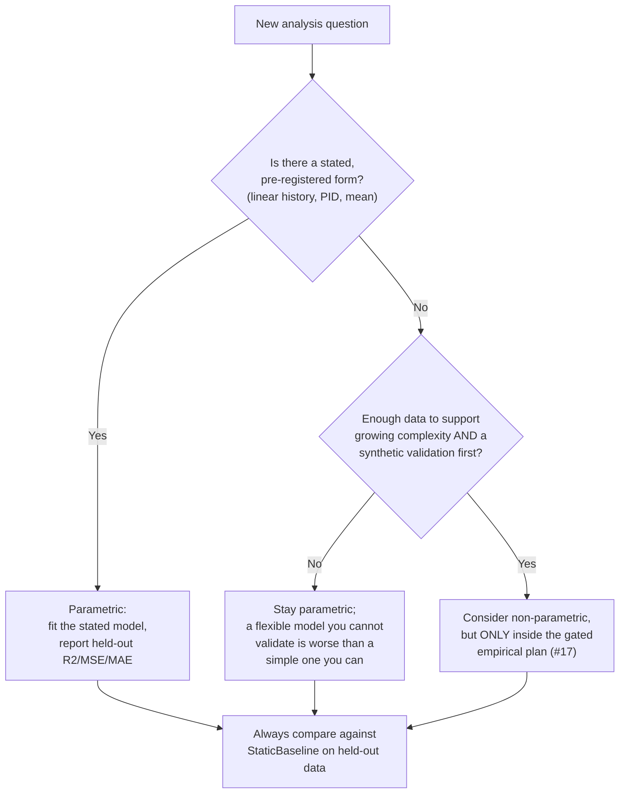

# Methods: Design Decisions, Current State, and Contributor Guide

This document is for **new contributors, including those new to data science**. It explains what is implemented and why, what is only planned, how to choose between parametric and non-parametric approaches for future work, and the hygiene rules that keep this repository trustworthy. Read it alongside [METHODS_SCOPE.md](METHODS_SCOPE.md) (the formal scope statement) and [STATUS_AND_PLAN.md](STATUS_AND_PLAN.md).

## Done

Everything below exists in the code and is covered (directly or through the shared validation path) by `tests/test_control_models.py`.

### Retained models and helpers (`src/control_models.py`)

- **`OptimalController`** — a linear history-based predictor. Prediction = weighted sum of the last `history_length` values plus a bias, fit by ordinary least squares (`np.linalg.lstsq`) with an intercept column. The constructor takes `history_length` (default 5) and `learning_rate` (default 0.001). **Design note:** `learning_rate` is retained only for interface compatibility — no iterative optimization happens; the fit is a closed-form least-squares solve. This is deliberate: a deterministic, one-shot solve cannot diverge, needs no convergence checks, and gives bit-reproducible results in tests.
- **`AutoregressiveModel`** — a thin wrapper that fits an `OptimalController` with `history_length=order` and copies its parameters. **Why a wrapper at all:** it lets comparisons name the same method by its standard statistical label ("AR model") without duplicating fitting code.
- **`PIDController`** — a proportional–integral–derivative reference. `fit` simulates one-step responses on the training portion for every gain combination on a coarse grid (`kp` ∈ 0–10, `ki`/`kd` ∈ 0–1, 6 points each, 216 combinations), keeps the lowest-error triple, then scores once on held-out data. If `setpoint` is omitted, the training mean is used; a non-finite setpoint is rejected. **Why grid search:** it is deterministic and inspectable; there is no optimizer state to debug.
- **`StaticBaseline`** — always predicts the training mean. **Why it exists:** any history-based model must beat this trivial yardstick before its complexity is justified. It has `n_params = 1`.
- **`preprocess_spike_train`** — bins event times into `n_bins = int(duration / bin_size)`, converts counts to rates, and convolves with a normalized Gaussian window of width `sigma` bins (window half-width capped at `min(10, (n_bins-1)//2)` so `mode="same"` convolution preserves length). Empty event sequences are valid and return an all-zero rate.
- **`compare_models`** — fits all four retained models on one series and returns a result mapping per model. A model-level `ValueError`, `FloatingPointError`, or `numpy.linalg.LinAlgError` becomes an `{"error": ...}` entry rather than aborting the comparison; common input validation (minimum length 10) happens before any model runs and still raises.
- **`_as_finite_series`** — the single validation funnel: every public entry point requires a one-dimensional, finite, numeric series of sufficient length, and raises `ValueError` otherwise.
- **`_r2_score`** — dependency-free R²; returns `nan` when target variance is zero (constant target), because the coefficient of determination is undefined there. This is a documented contract, not a bug.
- **`_estimate_decay_scale` / `compute_control_params`** — descriptive summaries of fitted lag weights (decay time constant, total gain, dominant lag, weight dispersion). These are descriptions of a fitted model, not stability proofs or biological quantities.

### Tests

`tests/test_control_models.py` currently verifies, using only in-memory synthetic series (a `linspace` ramp, a sine wave, short event-time lists):

- preprocessing returns aligned time/rate arrays of the expected length with finite values;
- a fitted `OptimalController` predicts a finite value from a correctly sized history;
- a too-short history raises `ValueError`;
- `compare_models` returns exactly the four retained model names, each with `n_params` or `error`;
- the baseline rejects non-finite input.

### Tooling

`tools/check_public_boundary.py` scans tracked files for prohibited path categories and unsupported public-claim markers. It is a guardrail, not a substitute for review.

## Intended

Nothing below is implemented. Items come from the open issue backlog; each entry is a task card with acceptance criteria.

- **Edge-case test cards (ready, good first issue):** #10 (empty event sequence preprocessing), #11 (event times outside the stated duration raise `ValueError`), #12 (`predict` before `fit` raises `ValueError`), #13 (non-finite PID setpoint raises `ValueError`), #14 (constant-target R² returns `nan`).
- **Documentation cards (ready):** #8 (clarify the finite 1-D series contract in `METHODS_SCOPE.md`), #9 (document per-model failure handling in the `compare_models` docstring).
- **Blocked integration cards:** #15 (review the validation contract once #8, #9, #11–#13 land) and #16 (integrate the new tests once #10–#14 land).
- **Gated research planning:** #17 — a Scientific-Owner-approved plan for any future empirical evaluation. **No dataset, derived output, figure, or empirical claim may enter the public tree**; the card exists to define the boundary *before* any research-facing work. Closed issue #5 shows an earlier version of this gate, superseded by #17.

The deferred/dropped table in [DEFERRED_AND_DROPPED_DIRECTIONS.md](DEFERRED_AND_DROPPED_DIRECTIONS.md) records what will not be added publicly: data acquisition, data-dependent workflows, figures, notebooks, archives, and empirical interpretation.

## Design decisions and their reasons

1. **Closed-form least squares instead of gradient descent.** Deterministic, reproducible, no convergence failures in CI. Cost: `learning_rate` is inert configuration. If a future model genuinely needs iterative fitting, that model — not `OptimalController` — should introduce it, with a fixed seed and an iteration cap.
2. **Chronological 70/30 split, not random shuffling.** For time series, shuffling leaks future information into training. The split is `n_train = max(2, int(0.7 * n))` (models) and requires at least 2–3 held-out points, raising `ValueError` otherwise. Rule: **never random-split a time series** in this repository.
3. **Coarse bounded grid for PID gains.** Deterministic and inspectable. The grid bounds (kp ≤ 10, ki/kd ≤ 1) are a pragmatic choice, not a theoretical optimum; a fit that selects a boundary value should be read as "the true optimum may lie outside the grid."
4. **Failures become `error` entries in `compare_models`.** One bad model must not hide the results of the others, and the comparison must remain callable in tests on awkward synthetic inputs.
5. **`nan` for undefined R².** Silently returning 0 or 1 for constant targets would fabricate a score. `nan` propagates honestly.
6. **Mean baseline included in every comparison.** A complex model that cannot beat the training mean has negative justification.
7. **Pure NumPy, no frameworks.** `requirements.txt` declares only NumPy, so the boundary scanner and tests run anywhere without data-adjacent dependencies.

### Undecided choices (with a rule for each)

- **How a future empirical evaluation would handle uncertainty** (bootstrap resampling vs. analytic intervals). *Rule:* choose only inside the gated plan (#17); prefer the option whose assumptions are stated and testable on synthetic data first.
- **Whether future preprocessing needs alternatives to Gaussian smoothing** (e.g., adaptive bandwidths). *Rule:* add a second smoother only if a synthetic test demonstrates a failure mode of the current one (e.g., very sparse bins); keep both deterministic.
- **History length / AR order selection** (fixed at 5 today). *Rule:* never tune on the held-out split; if selection is ever added, it must use a nested training-only criterion.

## Parametric vs. non-parametric: a decision guide

**Parametric methods** assume the data follow a specific form described by a fixed, small set of parameters. All retained models are parametric: the history model has `history_length + 1` parameters, the PID has 4, the baseline 1. *Assumptions:* linearity (history model), a fixed setpoint-and-error structure (PID), or constancy (baseline). *Advantages:* few parameters means little data needed, exact reproducibility, and interpretable weights. *Cost:* if the true relationship is not of the assumed form, the model is wrong no matter how much data you have.

**Non-parametric methods** let the effective complexity grow with the data (nearest neighbors, kernel smoothers, Gaussian processes). *Assumptions:* weaker but not absent — e.g., smoothness. *Advantages:* flexibility. *Costs:* more data needed, harder interpretation, more hyperparameters, and easier overfitting.



Concrete rules for this repository:

1. Every retained and proposed model must state its parameter count (`n_params`) — comparison across models must weigh complexity, not just score.
2. The public tree currently contains **only parametric models**, and new public models should be parametric unless a gated plan argues otherwise.
3. Any non-parametric proposal belongs in the gated empirical plan (#17), must run on synthetic data first, and must include a parametric baseline.
4. A parametric model that does not beat `StaticBaseline` on held-out data is evidence *against* its assumptions, and that outcome must be reportable — non-supportive results are results.

## Data-science hygiene rules

1. **Determinism and seeds.** The current code path contains no randomness at all — splits are chronological, the grid is fixed, least squares is exact. If randomness is ever introduced (e.g., synthetic noise in a test), seed it explicitly (`np.random.default_rng(seed)`) and state the seed in the test name or docstring.
2. **Synthetic ground truth first.** Every behavior must be demonstrable on an in-memory synthetic input where the correct outcome is known by construction (wrong-length history → `ValueError`; constant target → `nan` R²; empty events → zero rate). A method that cannot pass a synthetic check is not ready for any data.
3. **Null models.** `StaticBaseline` is the built-in null: the hypothesis "history helps" is only meaningful against "the mean is enough." Any future empirical plan must name its null models in advance, including non-control explanations.
4. **Test discipline.** Tests are file-free, network-free, deterministic, and test one contract each (mirroring the one-method-per-card pattern in issues #10–#14). Run the full suite and the boundary check before proposing any change:

```bash
python -m unittest discover -s tests -v
python tools/check_public_boundary.py
```

5. **Boundary discipline.** No datasets, outputs, figures, notebooks, caches, downloads, or external metadata in the public tree — see [RELEASE_BOUNDARY.md](RELEASE_BOUNDARY.md). Tests must not write files. Documentation must not contain empirical claims.
6. **Honest reporting.** Scores from this code are software outputs, not scientific evidence. Prediction alone cannot establish a feedback mechanism; say so wherever scores are shown.

## Where to start

Pick a ready, `good first issue` card (#8–#14), follow its acceptance criteria exactly, and keep the change inside its stated boundary. The cards are written so that a correct change is small, reviewable, and checkable with the two commands above.
