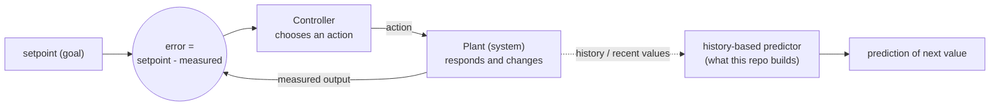

# Concept Figure: The Feedback Loop Behind Controller-Style Modeling

This file is the tracked, text-only stand-in for the repository's concept
figure. The public release boundary does not permit image files or figure
directories in the tracked tree (see `tools/check_public_boundary.py` and
[RELEASE_BOUNDARY.md](RELEASE_BOUNDARY.md)), so the figure is expressed here
as a Mermaid diagram that any Markdown viewer with Mermaid support renders
automatically.

**Caption:** A feedback control loop. A controller compares a measured
quantity against a setpoint, and the difference — the error — drives the next
action. The repository models the "history / recent values" part of this
picture with transparent history-based predictors, while deliberately not
claiming that any recorded neuron implements the full loop.

Reading the diagram:

1. The **setpoint** is the goal value.
2. The **summing junction** computes the error by plain subtraction.
3. The **controller** turns the error into an action.
4. The **plant** is whatever system the action acts on; its new output is
   measured and fed back, closing the loop.
5. The dotted branch is the part this repository actually implements: using
   recent values of a series to predict the next value, with no claim that
   the biological system contains the upper loop.
